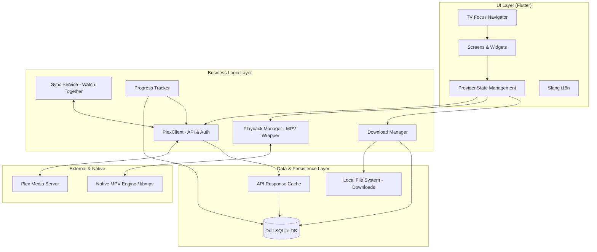

# Plezy 项目文档

## 1. 项目概览

### 1.1 项目名称与标识
- **项目名称**: Plezy
- **项目标识**: `com.edde746.plezy` (Android), `plezy` (General)
- **Logo**: 

### 1.2 项目背景与业务价值
Plezy 是一款现代化的 Plex 客户端，旨在为桌面和移动设备提供原生性能和简洁的界面。它解决了用户在不同平台上寻求统一且高性能的 Plex 媒体播放体验的需求。

### 1.3 项目目标与成功标准
- **项目目标**:
  - 提供跨平台的原生播放体验。
  - 支持高级媒体特性（HDR, Dolby Vision, ASS/SSA 字幕）。
  - 实现离线下载与同步播放（Watch Together）。
- **成功标准**:
  - 在 iOS, Android, Windows, macOS, Linux 平台上稳定运行。
  - 维持高性能的解码和流畅的用户界面。
  - 提供 100% 的 Plex 核心功能兼容性。

### 1.4 项目范围
- **包含范围**:
  - 媒体库浏览与搜索。
  - 基于 MPV 的高性能视频播放。
  - 离线媒体下载与管理。
  - 多服务器支持。
  - 国际化支持。
- **排除范围**:
  - 不包含 Plex Media Server 本身的开发。
  - 不支持非 Plex 协议的媒体源。

---

## 2. 项目组织架构

### 2.1 项目干系人清单
- **维护者**: edde746
- **社区贡献者**: 包含来自 GitHub 的开源贡献者。
- **最终用户**: Plex 媒体服务器用户。

### 2.2 核心团队角色与职责
- **开发负责人**: 负责架构设计、核心功能开发（如 MPV 集成）。
- **UI/UX 设计**: 负责多端适配的界面设计。
- **QA/测试**: 负责自动化测试编写与跨平台验证。

### 2.3 汇报关系与沟通渠道
- **代码托管**: GitHub (https://github.com/edde746/plezy)
- **问题反馈**: GitHub Issues
- **发布渠道**: App Store, Google Play, GitHub Releases

---

## 3. 技术架构

### 3.1 系统架构图

#### 架构层级说明：
- **UI 层 (Flutter)**: 负责多端界面的呈现。包含自适应布局组件、基于 `Provider` 的状态管理、多语言支持以及针对 TV 端优化的焦点导航系统。
- **业务逻辑层**:
    - `PlexClient`: 核心 API 通讯，处理 OAuth 认证和多端点故障切换。
    - `Playback Manager`: 屏蔽不同平台底层播放器的差异，提供统一的 `Player` 接口。
    - `Download Manager`: 管理离线下载队列、断点续传及文件校验。
    - `Sync Service`: 处理“一起看” (Watch Together) 的实时同步逻辑。
- **持久化层**:
    - 使用 `Drift` 驱动的 SQLite 数据库存储元数据、播放进度和下载记录。
    - `API Cache`: 拦截网络请求，实现秒开体验及离线浏览。
    - `File System`: 安全地管理下载的加密/原始媒体文件。
- **外部/原生层**:
    - `Plex Media Server`: 远程数据源。
    - `Native MPV Engine`: 通过原生插件 (C/C++, Swift, Kotlin) 调用底层解码库。

### 3.2 核心技术栈说明
- **前端框架**: Flutter (v3.8.1+)
- **编程语言**: Dart
- **状态管理**: Provider (Riverpod 风格的 Provider 扩展)
- **本地数据库**: Drift (SQLite)
- **网络请求**: Dio
- **播放引擎**: MPV (通过 MPVKit 和 libmpv-android 集成)
- **国际化**: Slang (JSON 格式)
- **代码生成**: build_runner (json_serializable, drift_dev)

### 3.3 数据流与接口设计
- **身份验证**: 使用 Plex OAuth 流程，通过 `PlexAuthService` 管理令牌。
- **元数据同步**:
  - 通过 `PlexClient` 调用 Plex HTTP API 获取数据。
  - 响应支持 JSON 格式，通过 `json_serializable` 自动解析为模型类（如 `PlexMetadata`, `PlexLibrary`）。
  - 实现缓存机制：使用 `ApiCache` 表（Drift 数据库）存储原始 JSON，支持离线访问。
- **播放数据**:
  - 实时通过 `PlaybackProgressTracker` 将进度上报至 Plex 服务器。
  - 离线状态下，进度记录在 `OfflineWatchProgress` 表中，待网络恢复后由 `OfflineWatchSyncService` 异步同步。
- **多服务器支持**:
  - `MultiServerManager` 协调不同服务器之间的请求分发。
  - 支持自动连接选择（Local vs Remote）。

### 3.4 目录结构说明
- `lib/data/`: 静态数据（如 ISO 639 代码）。
- `lib/database/`: Drift 数据库定义与表结构。
- `lib/focus/`: TV 模式下的焦点导航逻辑（D-pad 支持）。
- `lib/i18n/`: 国际化 JSON 文件及生成的 Dart 代码。
- `lib/models/`: 数据模型（包含 Plex 协议相关实体）。
- `lib/mpv/`: 播放器核心，封装了对 `libmpv` 的调用。
- `lib/providers/`: 全局状态管理（Settings, Server State, Theme 等）。
- `lib/screens/`: 各功能模块的 UI 页面。
- `lib/services/`: 业务逻辑服务（API 客户端、下载管理、快捷键等）。
- `lib/utils/`: 工具类（格式化、日志、平台检测等）。

---

## 4. 开发规范

### 4.1 代码管理策略
- 使用 Git 进行版本控制。
- 所有非琐碎的更改必须通过 Pull Request 提交。

### 4.2 命名与编码风格
- **文件命名**: 统一使用 `lower_snake_case`。
- **类命名**: 使用 `UpperCamelCase`。
- **变量/函数**: 使用 `lowerCamelCase`。
- **生成代码**: 运行 `dart run build_runner build` 生成 `*.g.dart` 文件。

### 4.3 代码审查流程
- 提交 PR 后，需通过 CI 检查（Lint + Tests）。
- 代码需符合 `analysis_options.yaml` 中定义的规则，严禁忽略静态分析警告。

### 4.4 国际化 (i18n) 标准
- 禁止在 UI 中硬编码中文字符串。
- 所有文本需定义在 `lib/i18n/strings.i18n.json` 中。
- 新增语言需创建 `strings_[locale].i18n.json` 并运行 `dart run slang`。

---

## 5. 项目计划

### 5.1 里程碑与版本
- **版本号格式**: `major.minor.patch+build` (例如 `1.12.0+28`)。
- **版本更新**: 修改 `pubspec.yaml` 中的 `version` 字段，发布时由 GitHub Action 自动递增 build number。

### 5.2 常用开发命令
- **安装依赖**: `flutter pub get`
- **生成代码**: `dart run build_runner build --delete-conflicting-outputs`
- **运行 App**: `flutter run`
- **运行测试**: `flutter test`
- **格式化代码**: `dart format .`

### 5.3 资源分配计划
- 优先处理 MPV 播放稳定性相关 Issue。
- 定期更新多语言翻译。

### 5.4 风险登记册
- **技术风险**: 跨平台 MPV 库的兼容性问题。
- **平台风险**: 移动应用商店的审核策略。

---

## 6. 质量保障

### 6.1 测试策略
- **单元测试**: 针对数据模型和逻辑函数。
- **集成测试**: 针对核心 API 交互。
- **UI 测试**: 关键页面的 Widget 测试。

### 6.2 自动化测试覆盖率
- 持续集成 (CI) 环境中运行 `flutter test`。

### 6.3 性能指标要求
- 启动时间 < 2s。
- 视频首帧加载速度 (依赖网络)。
- 内存占用在合理范围内。

### 6.4 验收标准
- 核心播放功能无崩溃。
- 元数据准确显示。
- 下载任务可恢复且正确保存。

---

## 7. 运维支持

### 7.1 编译指令
根据目标平台运行对应的编译指令：
- **Android**: `flutter build apk --release` 或 `flutter build appbundle --release`
- **iOS**: `flutter build ipa --release`
- **macOS**: `flutter build macos --release`
- **Windows**: `flutter build windows --release`
- **Linux**: `flutter build linux --release`

### 7.2 监控与日志
- **开发环境**: 日志输出至控制台，使用 `AppLogger` 过滤敏感信息。
- **生产环境**: 错误日志可通过应用内的“设置 -> 日志”查看并导出。

### 7.3 部署流程
1. **CI 流程**: 提交代码 -> `ci.yml` (Lint + Test)。
2. **发布流程**: 触发 `release.yml` -> 自动增加 Build Number -> 打 Tag -> 触发各平台编译流水线。

### 7.3 灾难恢复方案
- 数据库版本迁移由 Drift 处理。
- 本地配置丢失可通过 Plex 重新登录同步。

### 7.4 运维文档索引
- [Release Workflow](.github/workflows/release.yml)
- [Build Instructions](README.md#building-from-source)

---

## 8. 附录

### 8.1 常用命令速查
| 命令 | 说明 |
| :--- | :--- |
| `dart run slang` | 更新国际化文件 |
| `dart run build_runner build` | 触发一次性代码生成 |
| `dart run build_runner watch` | 持续监听文件变化并生成代码 |
| `flutter analyze` | 运行静态检查 |
| `flutter format .` | 格式化全项目代码 |

### 8.2 术语表
- **Plex**: 媒体服务器软件。
- **MPV**: 开源跨平台媒体播放器引擎。
- **Drift**: Dart 的响应式持久化库（基于 SQLite）。
- **D-pad**: 方向键，用于 TV 遥控器导航。

### 8.2 参考资料
- [Flutter Documentation](https://docs.flutter.dev)
- [Plex API Reference](https://github.com/Arcanemagus/plex-api)
- [MPV Documentation](https://mpv.io/manual/)

### 8.3 变更记录
- v1.12.0: 最新版本更新，包含多项性能优化和错误修复。

### 8.4 常见问题解答
- **如何添加新语言？**: 见 [CONTRIBUTING.md](CONTRIBUTING.md#adding-new-languages)。
- **编译失败？**: 确保 Flutter SDK 版本符合要求。

---

## 9. 核心代码解析

### 9.1 Plex API 交互 (`PlexClient`)
`PlexClient` 是与 Plex Media Server 通信的核心类，封装在 `lib/services/plex_client.dart` 中。
- **配置与拦截**: 使用 `Dio` 客户端，配置了 10 秒连接超时和 120 秒接收超时。通过 `EndpointFailoverManager` 实现多端点故障转移，确保在本地和远程连接间自动切换。
- **离线支持**: 集成了 `PlexApiCache`。当 `_offlineMode` 为 true 时，所有 API 调用会拦截请求并从本地 SQLite 数据库中提取缓存的 JSON 响应。
- **Lenient UTF-8**: 针对 Plex 服务器可能返回的不规范 UTF-8 字符，使用了自定义的 `_lenientUtf8Decoder` 以防止解析崩溃。

### 9.2 播放器架构 (`Player` 接口)
播放器采用抽象接口设计（`lib/mpv/player/player.dart`），解耦了 UI 与底层播放引擎。
- **状态驱动**: `PlayerState` 提供同步的状态快照，而 `PlayerStreams` 则提供响应式的状态流（如进度、音量、轨道变化）。
- **多平台适配**:
  - `PlayerNative`: 负责 iOS/macOS 上的 `libmpv` 交互。
  - `PlayerWindows`/`PlayerLinux`: 负责桌面端特定平台的集成。
- **渲染技术**: 使用 Flutter 的 `Texture` 组件实现视频渲染，通过 `textureId` 将原生视频帧直接显示在 Flutter Widget 树中。

### 9.3 响应式数据库 (`AppDatabase`)
基于 `Drift` (原 Moor) 实现，位于 `lib/database/app_database.dart`。
- **表结构**:
  - `ApiCache`: 存储原始 JSON 响应，支持 `pinned` 标记以防自动清理。
  - `DownloadedMedia`: 记录离线文件的本地路径、下载状态及媒体元数据。
  - `OfflineWatchProgress`: 核心同步表，记录离线时的播放进度和“已看”标记，支持版本迁移 (v7)。
- **迁移策略**: `MigrationStrategy` 确保了在应用更新时，本地数据能够平滑过渡，如 v7 版本新增的离线同步功能。

### 9.4 TV 焦点导航 (`DpadNavigator`)
针对电视设备（如 Android TV, Apple TV）的 D-pad 导航逻辑封装在 `lib/focus/`。
- **键位映射**: `DpadKeyExtension` 将 `LogicalKeyboardKey` 映射为语义化的 `isSelectKey`, `isBackKey`, `isDpadDirection` 等。
- **交互过滤**: 通过 `KeyEventActionable` 扩展，仅处理 `KeyDownEvent` 和 `KeyRepeatEvent`，避免 `KeyUpEvent` 导致的重复触发或逻辑错误。
- **焦点主题**: `FocusTheme` 定义了焦点态的视觉反馈（如边框高亮、缩放效果），确保在 10 英尺界面下的可读性。
